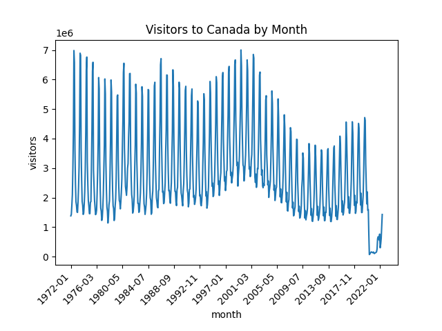

# Question 1: Number of Visitors Entering Canada by Month

Create a plot showing the number of non-resident visitors entering Canada each month. Are there any trends that can be observed? What effect did the COVID-19 pandemic have on the number of visitors?

Use pandas to read and manipulate the data, and Matplotlib to create the plot. You may wish to modify the following elements of the plot:

- xlabel, ylabel, and title
- The number xlabels
- The rotation of the xlabels

## Resources

- [Question Starting Point](canada_visitors_by_month.py)
- [Visitors to Canada Data](../../data/Canada_visitors.csv)
- [Matplotlib Tick Locating and Formatting](https://matplotlib.org/stable/api/ticker_api.html)
- [Fixing Common Date Annoyances](https://matplotlib.org/3.3.4/gallery/recipes/common_date_problems.html)

## Remarks on the Data

- "Non-resident visitors entering Canada" is the row of interest.
- There are many missing values in the data.
