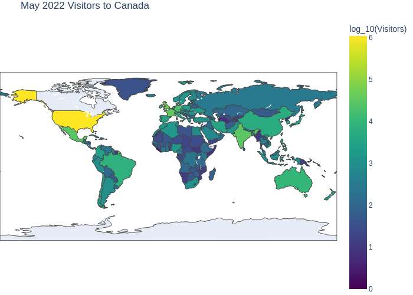

# Question 3: Map of Monthly Visitors Entering Canada

Create a map showing the number of non-resident visitors entering Canada from each country for the month of May 2022. What observations can you make?

Use pandas to read and manipulate the data, and plotly express choropleth to create the map.

## Resources

- [Question Starting Point](canada_visitors_map.py)
- [Visitors to Canada Data](../../data/Canada_visitors.csv)
- [Country Codes](../../data/countries_codes.csv)
- [Pandas Replace (dict-like)](https://pandas.pydata.org/docs/reference/api/pandas.DataFrame.replace.html)
- [Pandas Rename](https://pandas.pydata.org/docs/reference/api/pandas.DataFrame.rename.html)
- [Pandas fillna](https://pandas.pydata.org/docs/reference/api/pandas.DataFrame.fillna.html)
- [Pandas Merging DataFrames](https://pandas.pydata.org/docs/reference/api/pandas.DataFrame.merge.html)
- [Plotly Express Choropleth Maps](https://plotly.com/python/choropleth-maps/)
- [Plotly Colour Scales](https://plotly.com/python/builtin-colorscales/)

## Remarks on the Data

- Many country names need to be changed such that they match the names in the ISO3 codes file. For example:
  - "United States of America residents entering Canada" -> "United States"
  - "South Africa, Republic of" -> "South Africa"
  - And many more.
- There are many missing values in the data.
